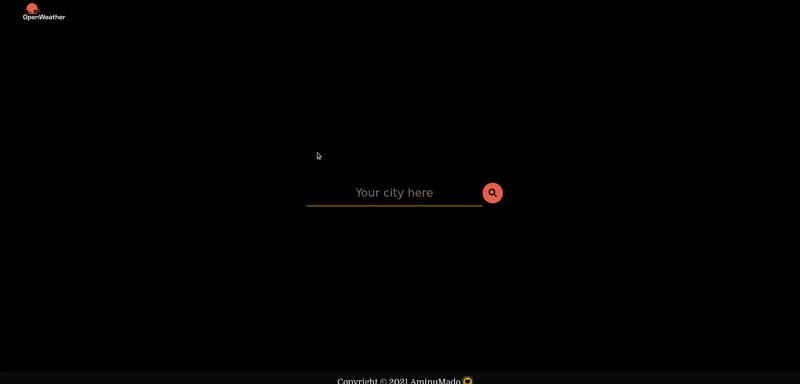

# Weather App

Project to create **Weather APP** using Vanilla JS, CSS and HTML

🔗 **Live preview:** 
<a href="https://aminumado.github.io/weather-app/" target="_blank" rel="noopener noreferrer">View the project here!</a> 👀

<h3>Summary</h3>

This is a Weather App where you can search a city and have weather details displayed. <a href="https://www.theodinproject.com/paths/full-stack-javascript/courses/javascript/lessons/weather-app" target="_blank" rel="noopener noreferrer">The Odin Project's</a> javascript curriculum. The goal of this project was to learn how to use asynchronous javascript, openweathermap api and promise.

<h3>Demo GIF</h3>

<h4>Desktop</h4>

## Built with

### Technologies

- HTML
- CSS
- JavaScript

### Tools

- Visual Studio Code
- Linux terminal
- Git and GitHub
- Npm
- Webpack
- prettier
- eslint

### Third party code

- [moments](https://momentjs.com/)

## Outcome

- Used **ES6 Modules** for more modular code.
- Used CSS3 **grid** and **flex** to create layout.
- Used **Git** and **GitHub** for project management.
- Used **OpenWeatherApi** for weatherdata
- Used **webpack**

## Summary

### What I learned

- ES6 Modules.
- Webpack
- Npm
- Favicons
- Async JS
- Promises
- Callbacks
- APIs
- Async/Await syntax

## Credit

All gif images used belongs to Bas Milius (Meteocons)

- GitHub: [basmilius](https://github.com/basmilius/weather-icons)

## Author

👤 **AminuMado**

- GitHub: [AminuMado](https://github.com/AminuMado)
